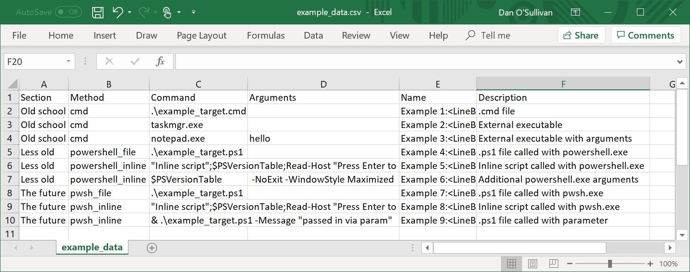
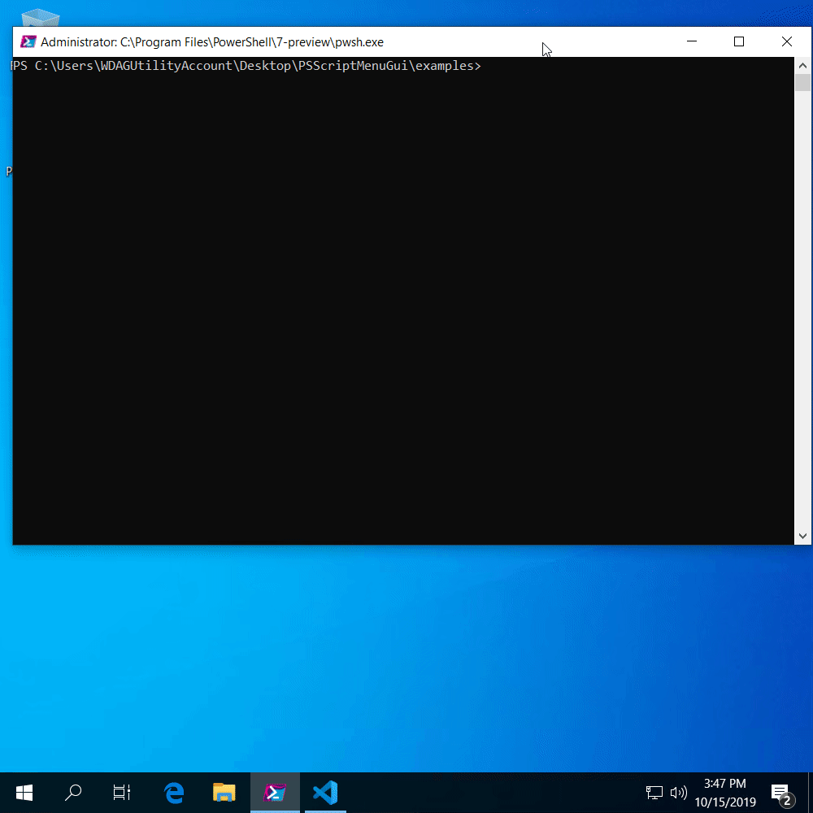

# PSScriptMenuGui

[](https://www.powershellgallery.com/packages/PSScriptMenuGui/) [](https://www.powershellgallery.com/packages/PSScriptMenuGui/) [](https://www.powershellgallery.com/packages/PSScriptMenuGui/)

Make a graphical menu of scripts and commands from CSV.

## Basic usage

```powershell
Show-ScriptMenuGui -csvPath '.\examples\csv\basic.csv' -Verbose
```

## Show-ScriptMenuGui options

Parameter | What is it?
:--- |:---
`-csvPath` | Path to CSV file that defines the menu.
`-windowTitle` | Custom title for the menu window.
`-buttonForegroundColor` | Button text color.
`-buttonBackgroundColor` | Button background color.
`-iconPath` | Path to `.ico` file.
`-hideConsole` | Hide the calling PowerShell console.
`-noExit` | Adds `-NoExit` to PowerShell host launch.
`-columns` | Optional layout columns for `Grid` mode.
`-rows` | Optional row target for `Grid` mode; auto-calculates columns to fit that row count (or validates explicit `-columns` against it).
`-buttonWidth` | Button width (80-600, default 150).
`-buttonHeight` | Button minimum height (25-300, default 50).
`-groupLayout` | `Stacked` (default), `Grid`, or `ColumnPerGroup`.
`-fullscreen` | Start in fullscreen/maximized mode.
`-borderlessFullscreen` | Borderless fullscreen (requires `-fullscreen`).

## CSV reference

Backward compatibility is preserved: existing `Command`-only rows continue to work.

Column header | What is it?
:--- |:---
Section *(optional)* | Heading/group
Method | `cmd` \| `powershell_file` \| `powershell_inline` \| `pwsh_file` \| `pwsh_inline`
Command | Target executable/script path or inline command
Arguments *(optional)* | Arguments passed to `Command`
WorkingDirectory *(optional)* | Process working directory
RunAsAdmin *(optional)* | `true/false`, `yes/no`, `y/n`, or `1/0`
Name | Button text
Description *(optional)* | Description text

## Multiple argument examples

See `examples/csv/multi-args.csv` for `.ps1`, `.cmd`, and `.bat` examples.

Quoting guidance:

- Quote argument values containing spaces: `-Name "My Value"`.
- For CSV cells with quotes, escape with double quotes, for example:
  `"-PatchOwner ""My Name"" -ShowPatches"`
- The doubled quotes above are CSV escaping rules (not PowerShell backtick escaping).
- For paths with spaces, quote the path in `Arguments`.
- For Windows paths in CSV, use normal backslashes (e.g. `"C:\Program Files\App"`).

## Layout examples

```powershell
Show-ScriptMenuGui -csvPath '.\examples\csv\grid-layout.csv' -groupLayout Grid -columns 2 -buttonWidth 180 -buttonHeight 60
```

```powershell
Show-ScriptMenuGui -csvPath '.\examples\csv\grid-layout.csv' -groupLayout ColumnPerGroup
```

`Stacked` keeps the legacy behavior.
Sections are grouped by section name (trimmed, case-insensitive), so CSV rows for the same section do not need to be contiguous.

## Layout visuals (before/after)

Before (legacy/stacked-style menu):



After (updated layout capabilities, including grid/fullscreen behavior):



## Fullscreen

```powershell
Show-ScriptMenuGui -csvPath '.\examples\csv\grid-layout.csv' -fullscreen
Show-ScriptMenuGui -csvPath '.\examples\csv\grid-layout.csv' -fullscreen -borderlessFullscreen
```

Press `ESC` to close in fullscreen mode.

## Auto-build CSV from scripts

```powershell
New-MenuCsvFromScripts -Path '.\scripts' -Recurse -OutputCsvPath '.\generated-menu.csv'
Show-ScriptMenuGui -csvPath '.\generated-menu.csv'
```

### New-MenuCsvFromScripts parameters

Parameter | What is it?
:--- |:---
`-Path` | Folder to scan for script files (required).
`-OutputCsvPath` | Path to write the generated CSV file. Required when `-LaunchGui` is used.
`-Recurse` | Scan subfolders recursively.
`-Append` | Append rows to an existing CSV instead of overwriting it.
`-IncludeExtensions` | Extensions to include (default: `.ps1`, `.cmd`, `.bat`).
`-SectionMap` | Hashtable mapping filename prefixes to section names. Longer prefixes take priority. Defaults: `Get`→`QUERIES`, `Add`/`New`→`NEW`, `Set`→`UPDATE`, `Remove`→`DELETE`.
`-DefaultSection` | Section name used when no prefix matches (default: `MISC`).
`-LaunchGui` | Generate CSV then immediately call `Show-ScriptMenuGui`. Requires `-OutputCsvPath`.
`-PassThru` | Return generated row objects to the pipeline.

### Minimal example

```powershell
New-MenuCsvFromScripts -Path '.\scripts' -OutputCsvPath '.\menu.csv' -LaunchGui
```

### Custom SectionMap example

```powershell
New-MenuCsvFromScripts -Path '.\scripts' -Recurse -OutputCsvPath '.\menu.csv' `
    -SectionMap @{ 'Get' = 'QUERIES'; 'Add' = 'NEW'; 'Set' = 'CHANGE'; 'Invoke' = 'ACTIONS' }
Show-ScriptMenuGui -csvPath '.\menu.csv' -groupLayout Grid -columns 2
```

### Naming convention prerequisites

For best results, follow PowerShell verb-noun naming for scripts:
- `Get-Users.ps1` → section `QUERIES`, name `Get-Users`
- `New-Ticket.ps1` → section `NEW`, name `New-Ticket`
- `Set-Config.ps1` → section `UPDATE`, name `Set-Config`
- `Remove-OldLogs.bat` → section `DELETE`, name `Remove-OldLogs`

Add `.SYNOPSIS` to `.ps1` files and a `REM` / `::` comment as the first line of `.cmd` / `.bat` files to populate the Description column automatically.

See: `examples/scripts/Generate-MenuAndLaunch.ps1`

## Troubleshooting

- **Arguments not parsed as expected**: verify CSV escaping/quoting.
- **Path not found**: use absolute paths or set `WorkingDirectory`.
- **Script blocked**: check execution policy and signing requirements.
- **No visible errors**: disable `-hideConsole` while troubleshooting.

## Automated tests

Run from repository root:

```powershell
Invoke-Pester -Path .\tests
```

Current coverage focuses on `New-MenuCsvFromScripts` behavior: metadata extraction, section mapping (default and custom), `DefaultSection` fallback, `IncludeExtensions` filtering, `LaunchGui` invocation, CSV output/append, and output path validation.

## Manual validation notes

In addition to automated tests, reproducible manual validation:

1. Import module and run `Get-Command -Module PSScriptMenuGui`.
2. Generate CSV via `New-MenuCsvFromScripts` and verify exported columns.
3. Launch menu in `Stacked`, `Grid`, `ColumnPerGroup`, and `Fullscreen` modes.
4. Validate legacy CSV rows with only `Command` still launch.
5. Validate repeated section names still render each section only once across all layouts.
